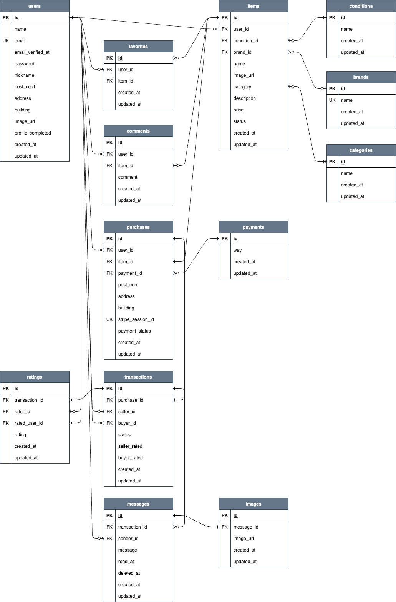

# coachtechフリマアプリ
ログイン後、それぞれの商品へのいいね登録&解除、コメント送信、商品の出品や購入ができます。
<br>
購入の際はクレジットカード払いかコンビニ払いを選択して決済ができ、それぞれの決済に合わせて購入者と出品者にメールが送信されます。
<br>

### TOPページ


## 作成した目的
学習のアウトプットのため
<br>
企業のフリマアプリを開発
<br>
<br>

## 機能一覧
|会員登録画面|ログイン画面|
| --- | --- |
|||
|名前、メールアドレス、パスワード、確認パスワードを入力して登録できます。|メールアドレス、パスワードを入力するとログインできます。|

|トップ画面|
| --- |
||
|未ログインユーザーは全商品一覧が表示されます。ログインユーザーは出品商品以外の商品一覧が表示されます。<br>検索バーで商品を検索でき、購入済みの商品はSold表示されます。|

|商品詳細画面（未購入商品）|商品詳細画面（購入済み商品）|
| --- | --- |
|||
|商品詳細情報が表示されます。いいね登録&解除、商品購入、コメント送信ができます。（ログインユーザーのみ）|購入済み商品の詳細情報画面では、Sold表示され購入ボタンは非表示になります。いいね登録&解除とコメント送信ができます。(ログインユーザーのみ）|

|メール認証画面|認証メール|
| --- | --- |
|||
|会員登録後、登録したメールアドレスに本人確認のための認証メールが送信されます。再送ボタンをクリックすると認証メールを再送信できます。|送信されたメールの認証ボタンをクリックすることでログインができます。|

|プロフィール設定画面（未設定状態）|プロフィール設定画面（設定済み状態）|
| --- | --- |
|||
|画像（任意選択）、ユーザー名（サイト上に表示されるニックネーム）、郵便番号、住所、建物名（任意）を入力し登録します。<br>初回ログイン時に設定画面に遷移しますが、プロフィールが未設定の場合は次回以降のログイン時にも設定画面に遷移します。プロフィールが未設定の状態でコメント送信、出品、購入はできません。|マイページのプロフィール編集ボタンよりプロフィールを編集できます。現在設定している情報が表示されます。|

|おすすめ商品画面|マイリスト商品画面|
| --- | --- |
|||
|トップ画面の「おすすめ」をクリックするとおすすめ商品が表示されます。<br>ログインユーザーでいいね登録のある場合は、いいね登録している商品のカテゴリーを参考に表示されます。<br>未ログインユーザーやいいね登録していないログインユーザーは状態の良い商品が表示されます。|トップ画面の「マイリスト」をクリックするといいね登録している商品が表示されます。検索バーで商品を検索できます。<br>未ログインユーザーは「マイリスト」は表示されません。|

|購入画面|配送先設定画面|
| --- | --- |
|||
|支払い方法と配送先住所を設定できます。購入ボタンをクリックすると決済画面に遷移します。配送先住所欄の「変更する」ボタンをクリックすると配送先設定画面に遷移します。|入力し変更ボタンをクリックすると購入画面の配送先が設定した住所に反映されます。この住所は購入した商品の配送先として紐づけられて登録されます。|

|決済画面|決済キャンセル画面|
| --- | --- |
|||
|メールアドレスとそれぞれの支払い方法での必要項目を入力して決済します。|決済画面にて戻るボタンをクリックするとキャンセル画面に遷移します。|

|カード決済成功画面|コンビニ支払い手順画面|
| --- | --- |
|||
|カード払いを選択し、決済が成功すると成功画面に遷移します。「マイページに戻る」ボタンをクリックすると購入商品一覧画面に遷移します。|コンビニ払いを選択し、決済が成功するとコンビニ支払い手順画面に遷移します。支払い可能なそれぞれのコンビニでの支払い手順が確認できます。|

|出品商品一覧画面|購入商品一覧画面|
| --- | --- |
|||
|マイページの「出品した商品」をクリックすると、出品した商品が表示されます。|マイページの「購入した商品」をクリックすると、購入した商品が表示されます。|

|出品画面|ログアウト|
| --- | --- |
|||
|商品画像、カテゴリー（複数選択可）、状態、商品名、ブランド（任意）、説明、価格を入力し商品を登録できます。|ログアウトボタンをクリックするとサイトからログアウトできます。|

### 購入者へのメール
|注文確認メール|コンビニ支払い手順メール|
| --- | --- |
|||
|決済完了時に購入した商品の内容と配送先を確認するメール。カード決済、コンビニ決済共通で送信されます。|コンビニ決済を選択して支払いボタンをクリックした際に、登録したメールアドレスにも支払い期限と手順が送信されます。|

|コンビニ決済完了メール|カード決済失敗メール|
| --- | --- |
|||
|支払い期限内に支払いが完了した際に送信されます。|カード決済時に残高不足などの理由で決済が失敗した際に送信されます。|

|コンビニ決済失敗メール|売り切れメール|
| --- | --- |
|||
|支払い期限までに支払いが完了しなかった場合に送信されます。|既に他の購入者によって購入済みの商品を購入した場合に送信されます。|

### 出品者へのメール
|商品売上通知メール|発送準備通知メール|
| --- | --- |
|||
|商品の購入完了時に出品者に送信されます。|カード決済とコンビニ決済それぞれで決済が完了した時点で出品者に送信されます。|

|注文キャンセルメール|
| --- |
||
|コンビニ支払い期限内に支払いが完了しなかった場合に出品者に送信されます。|

## 実行環境
Docker 27.5.1
<br>
nginx 1.21.1
<br>
php 8.3.8
<br>
mysql 8.0.26
<br>
phpMyAdmin 5.2.1
<br>
Mailhog
<br>
ngrok
<br>
stripe CLI 1.24.0

## 使用技術
Laravel Framework 8.83.8
<br>
Laravel Fortify
<br>
Stripe
<br>
HTML/CSS
<br>
Javascript
<br>
PHP
<br>

## テーブル設計
<br>


## ER図


## 環境構築

#### Docker ビルド
<br>
gitクローン

```
git clone githubのリンク
```
<br>
docker composeのバージョンによって一部記載が異なるため、はじめにバージョンを確認します。
<br>


```
docker compose version(docker-compose version)
```
<br>
  -v1の場合
<br>
docker-compose.ymlファイルのコメントアウトを外してください

```
version: '3.8'　(コメントアウト解除)
```

  -v2の場合
<br>
変更点なし
<br>

dockerビルド
```
docker compose up -d --build(docker-compose up -d --build)
```
<br>

> _Mac の M1・M2 チップの PC で設定しています。エラーが発生する場合は、platform: linux/x86_64をコメントアウトしてください。_
> docker-compose.yml ファイルの「mysql」、「phpMyAdmin」, 「mail」, 「ngrok」の4箇所に記載があります。_

```bash
mysql:
    platform: linux/x86_64(この文をコメントアウト)
    image: mysql:8.0.26
    environment:
```

<br>

#### Laravel環境構築
  1. PHPコンテナへ入る
  
  ```
  docker compose exec php bash(docker-compose exec php bash)
  ```
  <br>

  2. composer をインストール
  
  ```
  composer install
  ```

  <br>
  
  3. .env.example ファイルをコピーして.env ファイルを作成し、環境変数を変更する
  
  ```
  cp .env.example .env
  ```
  <br>
  ① アプリケーションキーを取得
  
  ```
  php artisan key:generate
  ```

  <br>
  ② APP_NAME設定
  
  ```
  APP_NAME=coachtechフリマ
  ```
 
  <br>
  
  ③ mysqlの設定(docker-compose.ymlを参照)
  
  ```
  DB_CONNECTION=mysql
  DB_HOST=mysql(変更)
  DB_PORT=3306
  DB_DATABASE=laravel_db(変更)
  DB_USERNAME=laravel_user(変更)
  DB_PASSWORD=laravel_pass(変更)
  ```
  <br>
  ④ mailhogの設定

  ```
  MAIL_MAILER=smtp
  MAIL_HOST=mail
  MAIL_PORT=1025
  MAIL_FROM_ADDRESS="送信元アドレス（例：flea-market@test.com）"
  ```
  <br>
  

  <br>
  <br>
  ⑤ stripeのアカウント設定
　<br>
  stripe公式ページ(https://stripe.com/jp)
  <br>
  
  <br>
  
  <br>
  

  
  ```
  STRIPE_KEY=公開可能キーを貼り付け
  STRIPE_SECRET=シークレットキーを貼り付け
  ```

  <br>
  ⑥ ngrokの設定
  <br>
  ngrok公式ページ(https://dashboard.ngrok.com/)
　<br>
  
  <br>
  
  ```
  NGROK_AUTHTOKEN=your_ngrok_auth_token
  ```
  <br>
  ⑦ stripe webhookの設定(stripeのアカウントが作成されている上で設定してください)
　<br>
  <br>
  ▫️Stripe CLI をインストールする(composerではインストールできません)
  <br>
  MacOS（Homebrew）
  
  ```
  brew install stripe/stripe-cli/stripe
  ```
  <br>
  Linux（Curl)
  
  ```
  curl -fsSL https://stripe-cli.github.io/install.sh | bash
  ```
  
  <br>
  Windows（Scoop)

  ```
  scoop install stripe
  ```
  <br>
  <br>
  ▫️Stripe CLI の動作確認
  <br>
  
  ```
  stripe --version
  ```
  →例：stripe version 1.24.0のようにバージョンが表示されればインストール成功
  
  <br>
  <br>
  ▫️ログインして Stripe に接続
  <br>

  ```
  stripe login
  ```
  →ターミナルにYour pairing code is: ************と表示される
  <br>
  →enterを押下するとstripeのブラウザが開くので、ターミナルに表示された『Your pairing code』と同じことを確認してアクセス許可を押下
  <br>
  


  <br>
  <br>
  ▫️ngrokのURLを確認する
  <br>
  ブラウザで ngrok の Web インターフェースにアクセスする (http://localhost:4040)
  <br>
  
  →`https://random-name.ngrok-free.app`のようにngrokのURLが表示されている（random-nameにはランダムに生成された値が入ります）
  <br>
  ※ngrokのコンテナを再起動させるたびにURLが変わるため、その都度Webhookを更新します
  <br>
  


  <br>
  <br>
  ▫️stripeのWebhookを設定する
  <br>
  <br>
  stripeダッシュボードの開発者→Webhook→送信先を追加するを押下
  <br>
  

  <br>
  <br>
  お客様のアカウントを選択
  <br>
  以下の9イベントを送信するイベントとして選択する（保存後に『送信先を編集』にて編集可）
  <br>

  - charge.failed
  - charge.succeeded
  - checkout.session.async_payment_failed
  - checkout.session.async_payment_succeeded
  - checkout.session.completed
  - payment_intent.created
  - payment_intent.payment_failed
  - payment_intent.requires_action
  - payment_intent.succeeded

  <br>
  

  <br>
  <br>
  イベント送信先にWebhookエンドポイントを選択
  <br>
  

  <br>
  <br>
  エンドポイントURLを設定
  <br>
  ngrok(http://localhost:4040)で確認したURLを以下のように編集し、設定する（保存後に『送信先を編集』にて編集可）
  <br>
  random-nameにはランダムに生成された値が入ります
  <br>
  <br>
  
  `https://random-name.ngrok-free.app` → **`https://random-name.ngrok-free.app/webhook/stripe`**
  <br>
  
  
  <br>
  <br>
  送信先を作成するを押下すると以下のような画面になります
  <br>
  右にある著名シークレットをコピーし、envファイルに記述する（Webhook の署名検証に必要）
  <br>
  
  
  ```
  STRIPE_WEBHOOK_SECRET=whsec_***********************
  ```
  <br>
  <br>
  変更後に .env の設定を反映
  
  ```
  php artisan config:clear
  ```

  <br>
  <br>
  ▫️イベント送信をテストする
  <br>
  Webhook画面の右側にあるテストイベントを送信ボタンを押下
  <br>
  実行コマンドが表示されるので、ターミナルで実行する
  <br>
  
  
  ```
  stripe trigger payment_intent.succeeded
  ```
  <br>
  laravel.logにて✅ Webhook 受信が確認できればOK
  <br>
  
  <br>
  <br>
  ▫️作成したWebhookを編集する場合
  <br>
  開発者→Webhook→現在使用しているWebhookを選択する
  <br>
  開いた画面の右側にある『送信先を編集』を押下
  <br>
  
  <br>
  <br>
  エンドポイントのURLやイベントを編集できるので、適宜編集して『送信先を保存』を押下
  <br>
  
  <br>
  
  <br>
  4. テーブル作成
  
  ```
  php artisan migrate
  ```

  <br>
  
  5. ダミーデータ作成
  
  ```
  php artisan db:seed
  ```
  

  <br>
  
  6. シンボリックリンク作成
  
  ```
  php artisan storage:link
  ```
<br>
## URL

- 開発環境
  - ログインページ <http://localhost/login>
- MailHog <http://localhost:8025>
- phpMyAdmin <http://localhost:8080>
- ngrok <http://localhost:4040>

